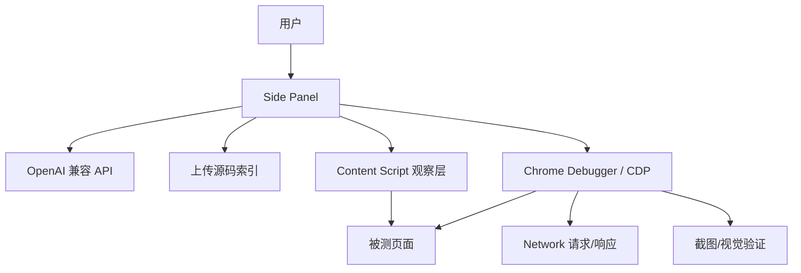

# AI 前端自动化测试浏览器扩展

> 一个 Chrome Side Panel 扩展：让 AI 读取前端项目源码、观察真实页面，并通过 CDP 真实鼠标键盘执行自动化测试。

## 项目简介

传统 AI 前端测试常常割裂成两类能力：

- 能读源码的 AI 编程助手，通常不能直接操作浏览器验证页面行为。
- 能操作浏览器的自动化工具，通常不了解项目源码和业务意图，只能在 DOM 上猜。

本项目把这两部分接起来：用户在扩展侧边栏上传源码、填写需求和测试用例，AI 会结合源码结构、DOM 快照、截图、网络响应和 CDP 真实输入来完成测试。

核心原则是：**Content Script 只负责观察，所有写操作都由 Chrome Debugger / CDP 执行。**

## 当前能力

- 选择目标标签页并在 Side Panel 中编排测试。
- 配置 OpenAI 兼容接口：`API URL`、`API Key`、`model`、上下文大小。
- 可选启用视觉模型能力：截图理解、标注截图、UI 验证截图。
- 可选启用模型 thinking 参数。
- 上传项目源码目录，支持 `.js`、`.vue`、`.ts`、`.jsx`、`.tsx`、`.css`、`.json`。
- 对上传源码做项目架构分析，并支持缓存、导入、导出。
- 基于「原始需求 + 架构分析」生成测试用例，并支持导出。
- 运行 AI 测试 Agent，支持中止、继续和运行中人工插话。
- 通过 CDP 执行点击、输入、滚动、按键、悬停、拖拽、截图和网络录制。
- 内置常见控件模板：下拉、多选、表单填写、按钮点击、弹窗、表格操作、Tab 切换、开关等。
- 记录测试断言、执行日志、AI 思考/响应流和测试结果。

## 使用方式

### 1. 加载扩展

1. 打开 Chrome，进入 `chrome://extensions/`。
2. 开启「开发者模式」。
3. 点击「加载已解压的扩展程序」。
4. 选择本项目目录：`web-ai-autotest`。
5. 点击扩展图标打开 Side Panel。

本项目是原生 Manifest V3 扩展，目前没有构建步骤，不需要先运行 `npm install` 或打包命令。

### 2. 配置 AI

在侧边栏填写：

- `API URL`：例如 `https://api.openai.com/v1`，也可以是兼容 OpenAI Chat Completions 的本地或云端服务。
- `API Key`：仅保存在扩展本地存储中。
- `模型`：填写服务端支持的模型名。
- `上下文大小 (K)`：用于控制源码和上下文注入规模。
- `模型支持图片`：模型支持多模态图片输入时勾选。
- `启用深度思考模式`：仅在目标模型支持 `thinking` 参数时勾选。

### 3. 执行测试流程

1. 打开被测页面。
2. 在扩展侧边栏选择目标标签页。
3. 填写要测试的原始需求。
4. 上传项目源码目录，通常上传 `src` 即可。
5. 点击「分析架构」，生成或导入架构分析。
6. 点击「AI 生成（基于需求+架构）」生成测试用例，或手动填写用例。
7. 点击「运行 AI 测试」。
8. 根据需要在运行中使用输入框追加指令，例如“跳过当前用例”“检查弹窗”“换一种方式”。

## 文件结构

```text
web-ai-autotest/
├── manifest.json
├── background/
│   └── service-worker.js        # Side Panel 行为、tab 关闭和 debugger 清理
├── content/
│   └── content.js               # DOM 快照、可交互元素、导航结构采集
├── core/
│   ├── agent-loop.js            # Agent 主循环、工具调度、防死循环
│   ├── ai-client.js             # OpenAI 兼容 Chat Completions 调用、流式输出、重试
│   ├── action-templates.js      # 常见控件的确定性操作模板
│   ├── network-recorder.js      # CDP Network 请求/响应记录
│   ├── project-analyzer.js      # 项目架构、路由、菜单、API、组件分析
│   ├── prompt-builder.js        # System Prompt、上下文和工具 schema
│   ├── source-analyzer.js       # 源码结构分析
│   ├── source-reader.js         # 上传源码索引和检索
│   ├── test-summary-cache.js    # 用例间摘要缓存
│   └── visual-controller.js     # CDP 截图、鼠标、键盘、滚轮、拖拽
├── sidepanel/
│   ├── sidepanel.html           # 侧边栏 UI
│   ├── sidepanel.css
│   └── sidepanel.js             # UI 状态、配置、源码上传、架构分析、测试编排
├── devtools/
│   ├── icon-16.png
│   ├── icon-48.png
│   └── icon-128.png
└── docs/
    ├── architecture.md
    └── feasibility-analysis.md
```

## 架构说明



各模块职责：

- **Side Panel**：唯一编排入口，负责读取配置、上传源码、调用 AI、运行 Agent Loop、展示日志和结果。
- **Content Script**：只观察页面，采集 DOM 快照、可交互元素、页面文本和运行时导航。
- **Chrome Debugger / CDP**：执行真实鼠标、键盘、滚轮、截图、拖拽和网络监听。
- **Background Service Worker**：处理侧边栏打开行为，并在 tab 关闭或侧边栏断开时清理 debugger。

## Agent 工具能力

AI 在测试过程中可调用的工具主要包括：

- 基础操作：`click`、`type`、`press`、`scroll`、`hover`
- 视觉/坐标操作：`screenshot`、`verify_ui`、`visual_click`、`visual_type`、`visual_scroll`、`visual_drag`、`visual_press`
- 智能定位：`find_element`、`smart_click`、`smart_type`
- 预设模板：`select_option`、`select_multi`、`fill_input`、`fill_form`、`click_button`、`close_dialog`、`table_action`、`switch_tab`、`confirm_dialog`、`toggle_switch`
- 状态读取：`eval_in_page`、`read_source`、`get_network_responses`
- 测试结果：`assert`、`finish`、`wait`

其中 `eval_in_page` 只用于读取页面状态，不能用于模拟用户操作。

## 安全与边界

- API Key 只保存在 `chrome.storage.local`，由 Side Panel 读取。
- API Key 不传给 Content Script，不注入被测页面，也不进入 prompt。
- 上传源码只在扩展侧本地索引，并按上下文需要提供给 AI。
- 写操作不使用 `el.click()`、`dispatchEvent()`、直接修改 `value` 等脚本模拟兜底。
- 如果 CDP attach 失败，测试会失败或提示环境不可用，而不是降级成不真实的脚本操作。

## 已知限制

- Chrome 同一 tab 只能有一个 debugger 连接。打开 DevTools 或其他自动化工具时可能导致 CDP attach 失败。
- 原生文件选择器、系统级弹窗、真实硬件输入等场景仍需要额外能力。
- 跨域 iframe、封闭 Shadow DOM、Canvas/WebGL 内部对象通常需要视觉坐标或业务源码辅助。
- 视觉能力依赖所配置模型是否真正支持图片输入。
- 当前项目没有自动化单元测试或构建脚本，主要以浏览器加载扩展后手动验证为主。

## 文档索引

- [架构设计](docs/architecture.md)
- [可行性分析](docs/feasibility-analysis.md)

## 开发备注

- 修改扩展代码后，在 `chrome://extensions/` 中点击刷新扩展，再重新打开 Side Panel。
- 调试时建议先关闭目标页面 DevTools，避免占用 `chrome.debugger`。
- 如果测试中断或页面关闭，Background 和 Side Panel 会尝试自动分离 debugger。
