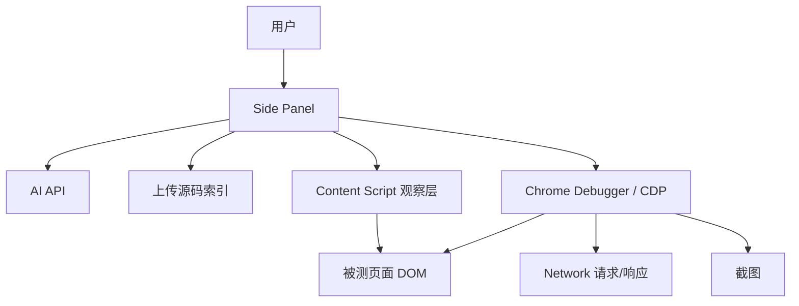
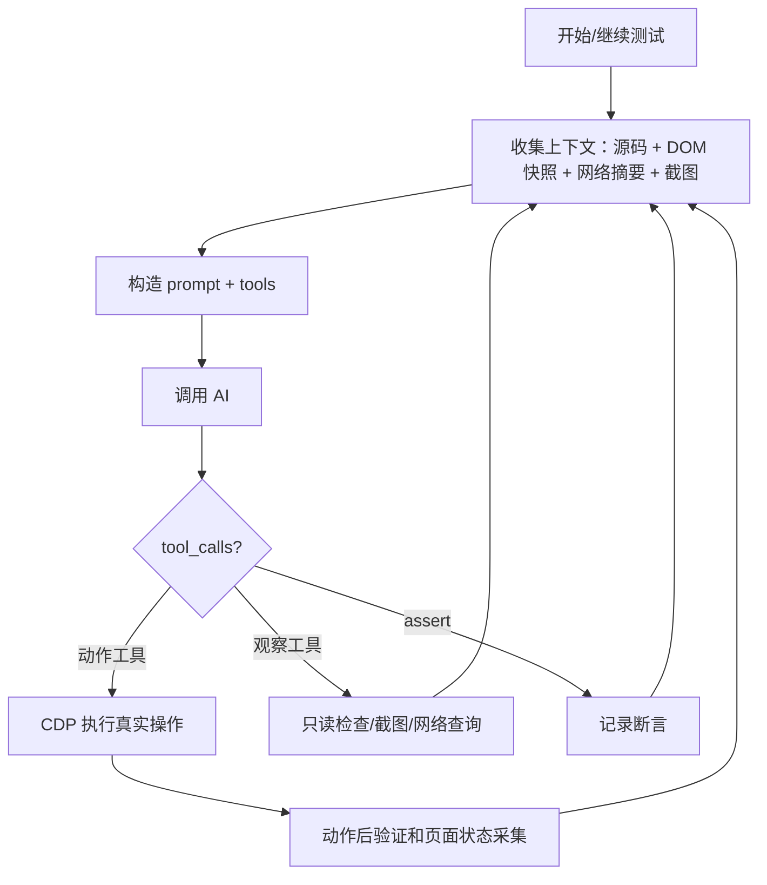

# 架构设计

## 核心原则

本项目的测试执行策略是：**Content Script 只观察，CDP 负责所有写操作**。

也就是说，页面状态可以通过 DOM 快照、只读 `evalInPage`、截图和网络记录观察；但点击、输入、滚动、悬停、拖拽、按键、下拉选择等用户行为必须通过 `chrome.debugger` 的 CDP `Input.*` 命令执行。CDP 附加失败时直接失败，不使用 `el.click()`、`dispatchEvent()`、修改 `value/checked/selected` 等脚本动作兜底。

## 扩展形态

Chrome Manifest V3 + Side Panel。

```
权限设计
- sidePanel + tabs      选择目标标签页并打开侧边栏
- scripting + activeTab 注入观察脚本，并在主世界只读检查页面状态
- storage               保存 API URL、Key、模型配置和用户输入
- host_permissions      允许 Side Panel fetch 用户配置的 AI 端点
- debugger              CDP 截图、真实鼠标键盘、滚轮、网络录制
```

`debugger` 权限是成熟自动化能力的核心。它会让 Chrome 显示“该扩展程序正在调试此浏览器”的提示，这是真实 CDP 控制的正常表现。测试结束或中止后会自动分离。

## 文件结构

```
aututest/
├── manifest.json
├── sidepanel/
│   ├── sidepanel.html
│   ├── sidepanel.css
│   └── sidepanel.js             # UI 和编排入口
├── background/
│   └── service-worker.js        # 生命周期、Side Panel、CDP 清理
├── content/
│   └── content.js               # DOM 快照、导航提取、选择器生成
├── core/
│   ├── agent-loop.js            # 主执行循环和工具分发
│   ├── action-templates.js      # 下拉、多选、表单、按钮等确定性模板
│   ├── visual-controller.js     # CDP 截图、鼠标、键盘、滚轮、拖拽
│   ├── network-recorder.js      # CDP Network 请求/响应记录
│   ├── prompt-builder.js        # system prompt 和 tools schema
│   ├── ai-client.js             # OpenAI 兼容 API 调用
│   ├── source-reader.js         # 用户上传源码索引和检索
│   ├── source-analyzer.js       # 源码结构分析
│   ├── project-analyzer.js      # 项目架构分析
│   └── test-summary-cache.js    # 用例间摘要缓存
└── devtools/
    ├── icon-16.png
    ├── icon-48.png
    └── icon-128.png             # manifest 图标资源
```

## 执行上下文

### Side Panel

Side Panel 是唯一编排者：

- 调用 AI API。
- 读取用户上传源码。
- 通过 `chrome.scripting.executeScript` 做只读页面检查。
- 通过 `chrome.debugger` 执行 CDP 真实输入、截图和网络录制。
- 运行 `agent-loop.js`，聚合日志、断言和测试结果。

### Content Script

Content Script 是观察层：

- 生成 DOM 快照。
- 提取可交互元素、文本、控件值、导航信息。
- 生成候选 selector。
- 响应 `AIFT_SNAPSHOT`、`AIFT_GET_NAVIGATION`、`AIFT_PING`。

Content Script 不执行测试动作，不接收 API Key，不调用 AI。

### Background Service Worker

Background 只做辅助：

- 管理 Side Panel 打开行为。
- 在 tab 关闭或 Side Panel 断开时清理可能残留的 CDP debugger。

## 数据流



## Agent Loop



关键约束：

- AI 不允许通过 `eval_in_page` 模拟用户操作。
- 基础 `click/type/press/scroll/hover` 均走 CDP。
- `select_option/select_multi/fill_input/click_button/toggle_switch` 等模板内部先只读定位，再用 CDP 操作，最后验证结果。
- 如果 CDP attach 失败，测试不能继续宣称“真实用户行为”。

## 视觉 + CDP

`visual-controller.js` 提供以下能力：

- `Page.captureScreenshot`：截图给视觉模型判断页面状态。
- `Input.dispatchMouseEvent`：真实鼠标移动、按下、释放、滚轮。
- `Input.dispatchKeyEvent` / `Input.insertText`：真实键盘和文本输入。
- `Page.getLayoutMetrics`：保证截图坐标和 CDP 坐标一致。

截图支持两种模式：

- `screenshot`：带可交互元素编号，帮助 AI 精确选择目标。
- `verify_ui`：无标注截图，专门用于布局、样式、视觉状态验证。

## 预设模板

预设模板用于减少 AI 在常见控件上的试错：

| 模板 | 目标 |
|---|---|
| `select_option` | 单选下拉，支持原生 select 和常见 UI 框架 |
| `select_multi` | 多选下拉/原生多选 |
| `fill_input` | 清空并输入，验证最终值 |
| `fill_form` | 批量填写表单，逐项验证 |
| `click_button` | 点击按钮，并可等待 loading/dialog/message/dropdown |
| `close_dialog` | 按钮、关闭图标、Escape 关闭弹窗 |
| `table_action` | 表格行内按钮操作 |
| `switch_tab` | Tab 切换 |
| `confirm_dialog` | 确认/取消弹窗 |
| `toggle_switch` | 开关、checkbox、radio 状态切换 |

模板设计原则：

- 页面内 JS 只用于定位和读取状态。
- 写操作全部由 CDP 完成。
- 有目标状态的操作必须验证。
- 失败时返回诊断信息，让 AI 能换策略。

## 网络录制

`network-recorder.js` 复用 `visual-controller.js` 的 CDP 连接，开启 Network 域：

- 记录 XHR/fetch 请求。
- 按 URL、方法、状态码、响应关键词过滤。
- 必要时通过 CDP 获取响应体。

测试断言应优先对比 API 响应和页面展示，避免只看 DOM 文本就误判。

## 安全边界

- API Key 只保存在扩展存储中，只由 Side Panel 读取。
- Key 不传给 Content Script，不注入被测页面，不进入 prompt。
- 上传源码只用于本地索引和 AI 上下文，不写回页面。
- CDP 连接在测试结束、用户中止、Side Panel 断开或 tab 关闭时清理。

## 已知限制

- `chrome.debugger` 同一 tab 只能有一个调试器连接。如果用户打开 DevTools 或其他工具占用 debugger，本产品会失败并提示，而不是降级成脚本模拟。
- 原生浏览器下拉弹层不是 DOM 节点，模板通过 CDP 键盘路径处理原生 select。
- Canvas/WebGL 内部对象需要视觉坐标或业务源码辅助定位。
- 封闭 Shadow DOM 只能通过视觉/CDP 坐标测试，无法通过普通 DOM 读取内部状态。
